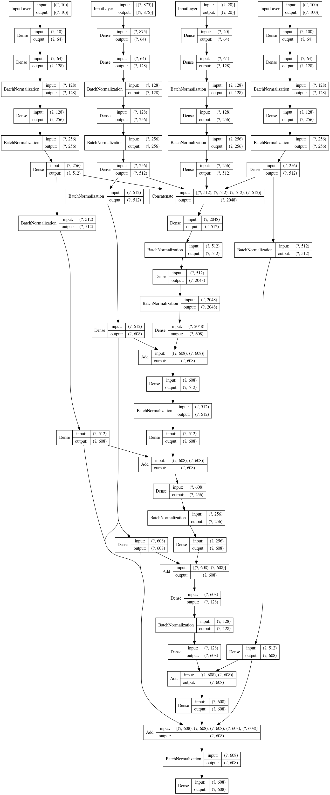
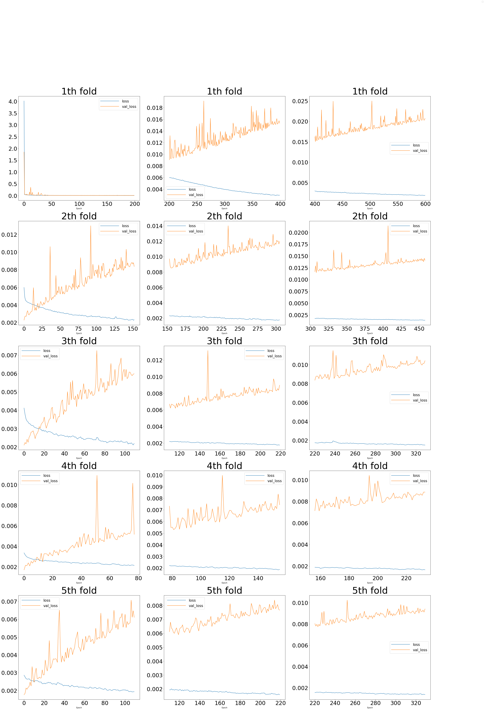

# Mechanims of Action Prediction

[Original Kaggle Notebook](https://www.kaggle.com/damoonshahhosseini/aggregated-neural-networks)

[MoA](https://www.kaggle.com/c/lish-moa) competition was hosted on Kaggle for a 2 month period on Kaggle:

The Connectivity Map, a project within the Broad Institute of MIT and Harvard, the Laboratory for Innovation Science at Harvard (LISH), and the NIH Common Funds Library of Integrated Network-Based Cellular Signatures (LINCS), present this challenge with the goal of advancing drug development through improvements to MoA prediction algorithms.

## What is the Mechanism of Action (MoA) of a drug? And why is it important?

In the past, scientists derived drugs from natural products or were inspired by traditional remedies. Very common drugs, such as paracetamol, known in the US as acetaminophen, were put into clinical use decades before the biological mechanisms driving their pharmacological activities were understood. Today, with the advent of more powerful technologies, drug discovery has changed from the serendipitous approaches of the past to a more targeted model based on an understanding of the underlying biological mechanism of a disease. In this new framework, scientists seek to identify a protein target associated with a disease and develop a molecule that can modulate that protein target. As a shorthand to describe the biological activity of a given molecule, scientists assign a label referred to as mechanism-of-action or MoA for short.

## How do we determine the MoAs of a new drug?

One approach is to treat a sample of human cells with the drug and then analyze the cellular responses with algorithms that search for similarity to known patterns in large genomic databases, such as libraries of gene expression or cell viability patterns of drugs with known MoAs.


# Data Analysis and preprocessing

In this competition, we were provided with a unique dataset that combines gene expression and cell viability data. The data is based on a new technology that measures simultaneously (within the same samples) human cells’ responses to drugs in a pool of 100 different cell types (thus solving the problem of identifying ex-ante, which cell types are better suited for a given drug). In addition, you will have access to MoA annotations for more than 5,000 drugs in this dataset.

As is customary, the dataset has been split into testing and training subsets. Hence, the task is to use the training dataset to develop an algorithm that automatically labels each case in the test set as one or more MoA classes. Note that since drugs can have multiple MoA annotations, the task is formally a ```multi-label classification problem.```

# Considerations

- Also cp_dose is one a categorical variable used within the data and it should be encoded.
- Given that cp_type equals ctrl_vehicle control pertubations have no MoAs, thus it would make sense to drop rows where this is the case. Yet, there will be a version of Input where this feature exists.
- ```sig_id``` column will be removed since it won't have significance within the data modelling process.

```python
# Encoding categorical variables
cp_dose = {'D1': 1, 'D2': -1} # Dictionary
cp_ctrl = {'trt_cp': 1, 'ctl_vehicle': -1}

# Mapping dictionaries to columns
train_features['cp_dose'], test_features['cp_dose'] = train_features['cp_dose'].map(cp_dose), test_features['cp_dose'].map(cp_dose)
train_features['cp_type'], test_features['cp_type'] = train_features['cp_type'].map(cp_ctrl), test_features['cp_type'].map(cp_ctrl)

# Deleting unecessary columns of data
del train_features['sig_id']
del test_features['sig_id']
```

# Scaling

Data was scaled using MinMaxScaler. The goal of scaling data has been to improving the converge of the Neural network while training.

```python
comb_scaled = MinMaxScaler().fit_transform(comb)

scaled_train_features = comb_scaled[0:train_len]
scaled_test_features = comb_scaled[train_len:]
```

# Dimension Reduction

Based on multiple training this method has not been helpful. PCA was used to reduce the dimension of the data:
```python
# PCA Versions
pca_genes = PCA(n_components=20).fit_transform(genes_comb)
pca_cells = PCA(n_components=10).fit_transform(cells_comb)
pca_all = PCA(n_components=100).fit_transform(comb)
```
# Different Data Inputs

The main Machine Learning algorithm used in this competition is Neural Networks which I have inputed the given data in different formats to the Neural Networks in order to capture different features and try to offset overfitting.

There will be 4 main type of input types to the  
1. all_data: All the data: Gene + Cell + Categorical
2. cells: Cell data seperated
3. Genes: Gene data seperated
4. Cells_image: Cell data reshaped to like a 10x10 image.

```python
# Input pipelines
all_input = Input(shape=(X.shape[1]), name='All')
cells_input = Input(shape=(Cells.shape[1]), name='Cells')
genes_input = Input(shape=(Genes.shape[1]), name='Genes')
# cell_image_input = Input(shape=(10,10,1), name='Cells_image')
pca_cell_input = Input(shape=pca_cells.shape[1], name='PCA_cells')
pca_gene_input = Input(shape=pca_genes.shape[1], name='PCA_genes')
pca_all_input = Input(shape=pca_all.shape[1], name='PCA_all')
```

# Models

1. The weights that are used in sigmoid layers should be relatively low (>=1e-3) for higher accuracy and better convergence.
2. The goal is write to minimalist Neural Networks (less than 1e6 params) to focus on particular entries and techniques, then aggregate all of them in one network.
3. Multi-input NN (uni-output):
    - Make a prediction in sub-NNs then aggregate the results to get a final result
    - Use inter-connected NNs
    - Use structures to find patterns within the data.
4. High scorig models have been saved to [NNMOA](https://www.kaggle.com/damoonshahhosseini/nnmoa?select=linear_nn01) (which is kaggle dataset)!

## Utilities used for NNs

Some functions were used to automate the process Neural Network construction. These functions are the inspired by the building block of famous Networks such as inception, resnet and basic feed forward.
```python
def residual_module(x, add, std=1, Unit=32, seed=11):
    """ A residual connection module """
    out = Dense(Unit, activation='relu', kernel_initializer=TruncatedNormal(0, std, seed))(x)
    out = BatchNormalization()(out)
    out = Dense(y_all.shape[1], activation='sigmoid', kernel_initializer=TruncatedNormal(0, std, seed))(out)
    
    return Add()([out, add])


def linear_NN(x, std, seed=1, unit=32):
    """ Symmetric Linear NNs ran on cells, genes, all_data """
    c = Dense(unit, activation='selu', kernel_initializer=TruncatedNormal(0, std, seed))(x)
    c = Dense(unit * 2, kernel_initializer=TruncatedNormal(0, std, seed))(c)
    c = BatchNormalization()(c)
    c = Dense(unit * 4, kernel_initializer=TruncatedNormal(0, std, seed))(c)
    c = BatchNormalization()(c)
    c = Dense(unit * 8, kernel_initializer=TruncatedNormal(0, std, seed))(c)
    
    return c
```

This model has all the type of inputs, it processes them individually then there is the part were the result of different sections are aggregated within the model. Residual connections are used at the end for the aggregation.

<p align="center">
    
</p>


# Overfitting

KFold validation was used on each of Neural Networks to avoid overfitting and result in a more general model. Details of training:

1. Based on trial and error results, batch size of 128 has shown to be effective.
2. Predictions for each part of the fold has been saved and used for the final prediction. Since each of these prediction set have captued a unique aspect of the given data.
3. Learning Rate has been reduced by a factor of 0.96 each 5 epochs.
4. Training data has been saved to a dictionary called histoy for later visualization and sanity check.

```python
def scheduler(epoch, lr): return max(1e-25, lr * 0.96 ** (epoch // 50))

BATCH_SIZE = 128
N_FOLDS = 5
kf = KFold(n_splits=N_FOLDS, random_state=1, shuffle=True)
history, index = {}, 0
prediction = np.zeros((test_features.shape[0], y.shape[1]))

for train_indices, val_indices in kf.split(X, y):
    
    print(f'{index + 1}th fold, Validation Indices: ', val_indices[:5])
    # Gene, y, and Cell data divided into Train and Validation splits
    X_train, X_val = Xs.loc[train_indices], Xs.loc[val_indices]
    train_cells, val_cells = Cells_scaled.iloc[train_indices], Cells_scaled.iloc[val_indices]
    train_genes, val_genes = Genes_scaled.iloc[train_indices], Genes_scaled.iloc[val_indices]
    y_train, y_val = y_all.iloc[train_indices], y_all.iloc[val_indices]
    
    pca_gene_train, pca_gene_val = pca_genes_train[train_indices], pca_genes_train[val_indices]
    pca_cell_train, pca_cell_val = pca_cells_train[train_indices], pca_cells_train[val_indices]
    pca_All_train, pca_all_val = pca_all_train[train_indices], pca_all_train[val_indices]
    
    # Instantiating the model
    model = Model(
        inputs=[all_input, pca_cell_input, pca_gene_input, pca_all_input], 
        outputs=[out])
    model.compile(optimizer=Adam(0.004), loss=BinaryCrossentropy())
    
    # Fitting
    history[index] = model.fit(
        x=[X_train, pca_cell_train, pca_gene_train, pca_All_train], 
        y=y_train, epochs=600, batch_size=BATCH_SIZE, verbose=0, 
        validation_data=([X_val, pca_cell_val, pca_gene_val, pca_all_val], y_val),
        callbacks=[ 
            ReduceLROnPlateau(factor=0.95, patience=20, 
            verbose=True, monitor='loss', 
            min_lr=1e-45, min_delta=1e-4),
            EarlyStopping(monitor='loss', 
            patience=200, restore_best_weights=True, 
            min_delta=1e-3, verbose=True)
        ]
    )
    
    model_prediction = model.predict(
        [Xs_test, pca_cells_test, pca_genes_test, pca_all_test], 
        batch_size=BATCH_SIZE, verbose=False)[:,:y.shape[1]]
    
    prediction += model_prediction / N_FOLDS
    
    index += 1
    print('#----------------#----------------#----------------#----------------#')
```

The output of the Kfold validation:

    1th fold, Validation Indices:  [ 0  2  4  7 11]

    Epoch 00404: ReduceLROnPlateau reducing learning rate to 0.003800000180490315.

    Epoch 00456: ReduceLROnPlateau reducing learning rate to 0.0036100000608712433.

    Epoch 00560: ReduceLROnPlateau reducing learning rate to 0.0030951235676184297.

    Epoch 00580: ReduceLROnPlateau reducing learning rate to 0.002940367278642952.
    #----------------#----------------#----------------#----------------#
    2th fold, Validation Indices:  [ 5  6  8 12 22]

    Epoch 00109: ReduceLROnPlateau reducing learning rate to 0.003800000180490315.

    Epoch 00319: ReduceLROnPlateau reducing learning rate to 0.0026536814169958235.

    . . . . . .. . . . . . . . .. . . . . .. . . . .. . . . . . . .. . . . . . . . 
    #----------------#----------------#----------------#----------------#
    5th fold, Validation Indices:  [14 15 18 20 27]

    Epoch 00039: ReduceLROnPlateau reducing learning rate to 0.003800000180490315.

    Epoch 00288: ReduceLROnPlateau reducing learning rate to 0.002161440090276301.

    Epoch 00324: ReduceLROnPlateau reducing learning rate to 0.00205336797516793.
    Restoring model weights from the end of the best epoch.
    Epoch 00331: early stopping
    #----------------#----------------#----------------#----------------#


# Plotting the Loss

The goal of this section has been to do a sanity check to see if the model is performing well enough? Also it is an easy way to spot Over or Underfitting.

Notes:

    - Plotting enables us to make assumptions about the state of the model and improve it
    - Difference between val_loss and loss, and the oscilations within the graph are things to look for

```python
num_cols = 3
fig, axes = plt.subplots(len(history), num_cols, figsize=(40,60))
fig.legend(["blue", "orange"], prop={"size":10})

for i in range(len(history)):
    d = pd.DataFrame(history[i].history)
    d['Epoch'] = range(0,d.shape[0])

#     d.iloc[:,:].plot(x="Epoch", y=["loss","val_loss"], ax=axes[i][0])
    for j in range(num_cols):
        d.iloc[d.shape[0]//num_cols*j:d.shape[0]//num_cols*(j+1),:].plot(
            x="Epoch", y=["loss","val_loss"], ax=axes[i][j], title=f'{i+1}th fold')
```

<p align="center">
    
</p>


Also another method to see if the model has performed well is to check for the maximum values of the predictions which they should be near to one (e-1 range):

```python
pd.read_csv('/kaggle/working/submission.csv').describe().T['max'].values
```

    array([
        3.41899277e-01, 3.97297535e-01, 1.80271579e-01, 3.01519305e-01, 4.50210683e-01, 
        3.76024914e-01, 4.43169971e-01, 6.69907718e-01, 9.96450633e-01, 9.06233802e-01,
        3.69386752e-01, 7.77800956e-01, 7.42034347e-01, 4.63538042e-01, 1.41146133e-01,
        1.21822198e-01, 3.57393571e-01, 4.57481904e-01, 4.18957926e-01, 4.17180490e-01,
        4.96874304e-01, 5.04139704e-01, 1.82359832e-01, 2.29336802e-01, 2.78229119e-01,
        1.00000001e+00, 1.00000001e+00, 6.86805968e-01, 4.75040015e-01, 3.82906355e-01,
        3.08378504e-01, 3.16471244e-01, 2.52540865e-01, 2.16203628e-01, 4.80325032e-01,
        1.00000001e+00, 6.62779385e-02, 5.44503211e-02, 3.12769688e-01, 3.03410192e-02,
        8.87395002e-01, 1.23671802e-02, 9.96419415e-01, 2.70011490e-01, 4.29754359e-01,
        3.76599765e-01, 3.22606941e-01, 5.92300579e-01, 4.26037162e-01, 9.91164878e-01, 
        3.21075475e-01, 7.82621004e-01, 1.00000001e+00, 1.18492608e-01, 1.25959115e-01, 
        1.95800078e-01, 2.34689378e-01, 1.61514340e-01, 1.95121876e-01, 4.09933403e-01,
        5.91044612e-01, 7.57749139e-01, 6.29413290e-01, 1.70009430e-01, 5.17198471e-01, 
        1.00000001e+00, 1.63594006e-01, 3.79003177e-01,3.78903096e-01, 9.69306275e-01, 
        2.40761611e-01, 4.40836718e-01, 5.53360922e-01, 5.24322651e-01, 2.42080353e-01, 
        5.90644787e-01, 4.00281353e-01, 2.01642981e-01, 7.64599564e-01, 1.00000001e+00,
        2.69104481e-01, 1.22389703e-02, 9.99983877e-01, 2.68245824e-01, 4.42358156e-01, 
        1.00000001e+00, 1.82426627e-01, 7.30424383e-01, 2.51441416e-03, 3.06788903e-01, 
        9.92314756e-01, 1.31705514e-01, 5.27393542e-01, 5.29573890e-01, 2.59592009e-01, 
        3.61687445e-01, 9.48909163e-01, 2.24641671e-01])

Also when going through the statisitics of the dataframe:

- Max should be in order of e-1.
- Min should be close to zero.
- Std should be relatively small (<1e-2)

given these results, our model will have a higher accuracy.